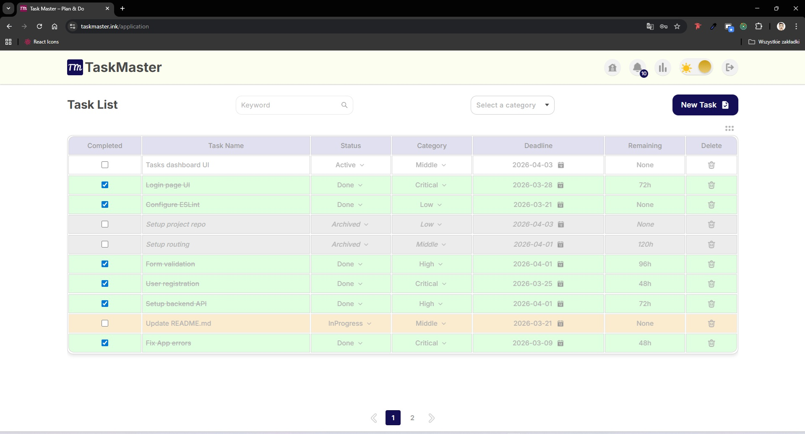
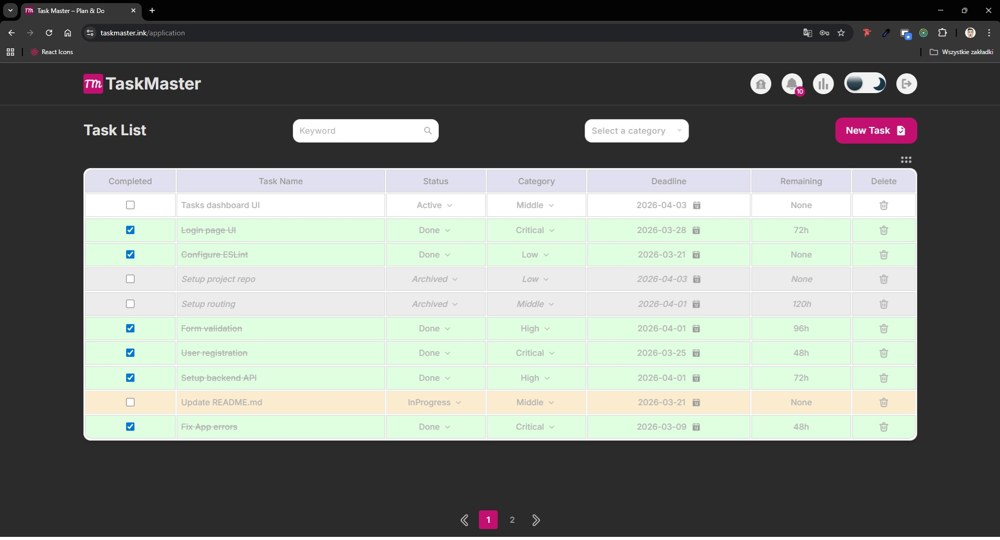
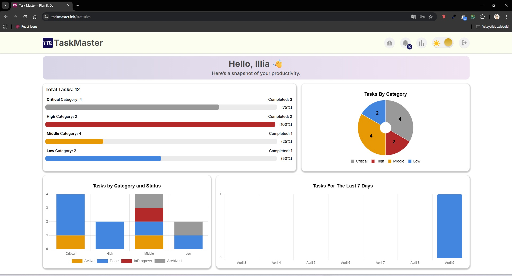
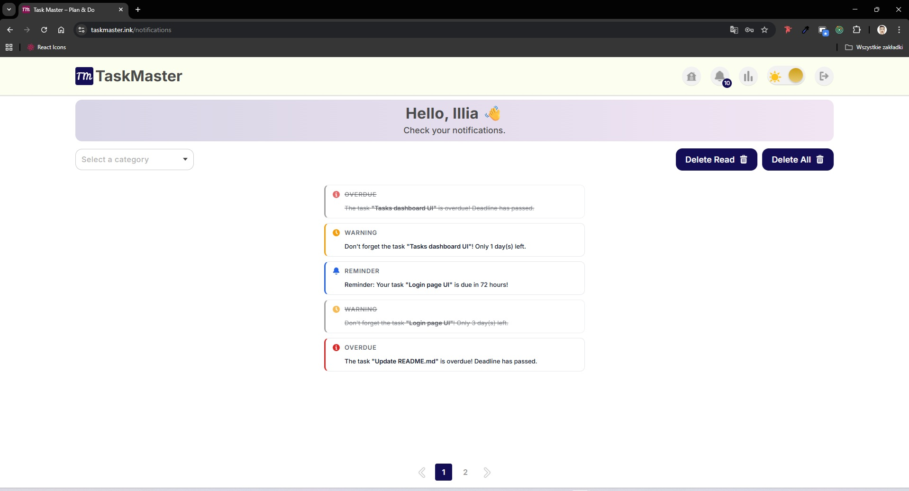

# TaskMaster Frontend

## Demo Account

You can log in using this demo account:

- Email: demo@taskmaster.app
- Password: Demo1234

_No email verification required for this account._
<a href="https://taskmaster.ink/" target="_blank">

</a>

_Login Page_


_Main Dashboard_


_Dark Theme_


_Statistics Page_


_Notifications Page_


Frontend application for **TaskMaster** — a task management platform with deadlines, notifications, and user authentication.  
Designed and implemented with a focus on real-world authentication flows, state management, and user experience.

## Links

[](https://github.com/Rohozhnyi-Illia/TaskMaster-backend)

---

## Key Features

- **Authentication & Security:** JWT login, refresh tokens, protected routes, email verification (except demo account)
- **Task Management:** create, update, delete, complete tasks; drag-and-drop ordering; filtering, sorting, pagination
- **Notifications:** deadlines, reminders, read/unread management
- **Analytics Dashboard:** task completion statistics with **Chart.js**
- **UX/UI:** dark/light mode, responsive, global loaders, toast notifications, form validation

---

## Technologies

- **Frontend:** React, TypeScript, Redux Toolkit, React Router, SCSS, Chart.js
- **Backend:** Node.js, Express, JWT Authentication, REST API
- **HTTP / API:** Axios with interceptors
- **Drag & Drop:** react-beautiful-dnd
- **Validation:** Yup
- **Code Quality:** ESLint, Prettier

---

## Architecture Notes

- All components, pages, and services have been migrated to TypeScript.
- Organized by feature: each page has its own folder with components and styles, plus shared components for cross-page reuse
- API logic isolated in services layer
- Centralized UI feedback system (loaders, error modals, success toasts)
- JWT authentication with automatic token refresh
- UI state separated from business data in Redux
- Drag & drop integrated with Redux for state persistence
- ESLint + Prettier ensure consistent and clean code

---

## Installation

```bash
git clone https://github.com/Rohozhnyi-Illia/Task-Master.git
cd Task-Master
npm install
```

## Running

```bash
npm start # development mode
npm run build # production build
```

- Default frontend URL: `http://localhost:3000`
- By default, the frontend uses the deployed backend: `https://taskmaster-backend-e940.onrender.com/api`
- To use a local backend:
  - run it on `http://localhost:9000`
  - update `src/services/api.js`

## Pages

- **Login** — user authentication
- **SignUp** — create a new account
- **VerifyEmail** — enter verification code sent to email after registration
- **UpdatePassword** — request password reset (only email required)
- **VerifyPassword** — confirm code and set a new password
- **Application** — main dashboard with tasks and notifications
- **StatsPage** — overview of completed tasks
- **NotificationsPage** — shows messages about upcoming deadlines and overdue tasks
- **NotFound** — 404 Not Found page for invalid routes

## API Services

Frontend communicates with TaskMaster-Backend through Axios services:

### AuthService

- register({ email, password, name }) — register a new user
- login({ email, password }) — login
- logout() — logout
- updatePassword({ email }) — request password reset (sends verification code)
- verifyEmail({ email, verifyCode }) — verify email after registration
- reVerifyEmail(email) — resend verification email
- verifyPassword({ email, newPassword, repeatPassword, verifyCode }) — confirm new password with code

### TaskService

- getAllTasks() — get all tasks
- createTask({ task, status, category, deadline, remainingTime }) — create a new task
- completeTask(id) - complete the task
- deleteTasks(id) — delete a task
- updateStatus(id, status) — update task status
- updateCategory(id, category) - update task category
- reorderTasks(orderedIds) - persist new task order after drag & drop

### NotificationService

- getUserNotifications() — get user notifications
- markAsRead(id) — mark a notification as read
- deleteNotification(id) — delete a notification
- deleteReadNotifications() - delete read notifications
- deleteAllNotifications() - delete all notifications

---

## Full Features Details

### Authentication & Security

- User registration and login with JWT authentication
- **Email verification after registration**
- **Password recovery with email verification**
- JWT-based access and refresh tokens
- Automatic token refresh via Axios interceptors
- **Protected routes:** private pages are guarded via `ProtectPath` component; non-authenticated users are redirected to login

### Tasks & Dashboard

- Task management: create, update, complete, and delete tasks
- Task sorting and filtering by category and keywords
- Pagination for large task lists
- Statistics page with completed tasks overview

### Notifications

- Task reminders, deadlines, and overdue alerts
- **Notifications page with user messages**
- Mark notifications as read or delete them

### UX & UI

- Global loaders and error modals
- **Global success notifications (toast system)**
- Optimistic UI updates
- Dark / light theme toggle
- Responsive design for mobile and desktop
- Consistent layout with shared Header component for all main pages (excluding auth pages)
- Validation of forms, deadlines, and data
- 404 Not Found page
- Custom favicon, app branding, and custom domain setup
- Drag & drop provides intuitive task organization

### Code Quality

- ESLint + Prettier setup for consistent code style and formatting
- Linting and formatting integrated in development workflow

## Notes

- Added email verification for registration and password recovery
- Backend must be running for frontend to function correctly
- Pagination improves performance on task-heavy dashboards
- Success toasts provide user feedback for completed actions

## Author

Illia Rohozhnyi
