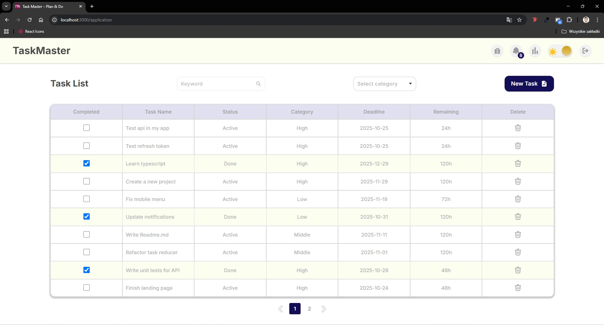
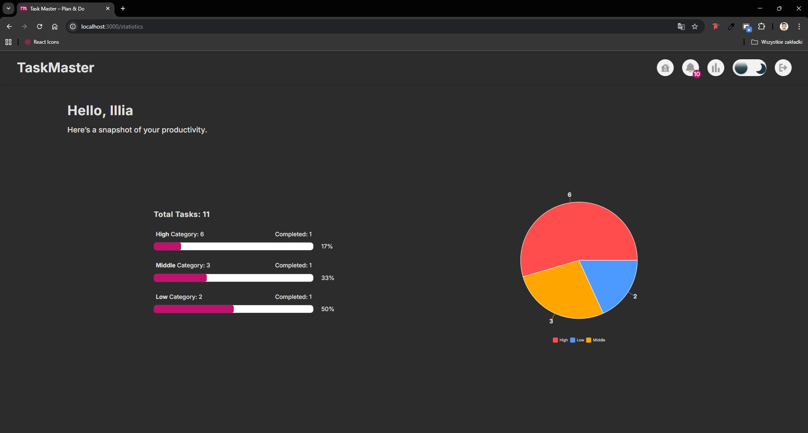

# TaskMaster Frontend

_Main Dashboard_


_Dark Theme_


_Statistics Page_


_Notifications Page_


Frontend application for **TaskMaster** — a task management platform with deadlines, notifications, and user authentication. Built with React, Redux Toolkit, SCSS, and Webpack.

## Links

[](https://taskmaster.ink/)  
[](https://github.com/Rohozhnyi-Illia/TaskMaster-backend)

## Features

- User registration and login with JWT authentication
- **Email verification after registration**
- **Password recovery with email verification**
- JWT-based access and refresh tokens
- Task management: create, update, complete, and delete tasks
- Task sorting and filtering by category and keywords
- Pagination on the main dashboard for large task lists
- Task notifications: reminders, deadlines, and overdue alerts
- **Notifications page with messages about deadlines**
- Dark/light theme toggle
- Responsive design for mobile and desktop
- Automatic token refresh and optimistic UI updates
- Error handling with modals and loaders
- Validation of forms, deadlines, and data
- Custom favicon, app branding, and custom domain setup

---

## Technologies

- React 18 / Hooks
- Redux Toolkit for state management
- React Router for navigation
- Axios with interceptors for API calls
- SCSS for styling
- Webpack for bundling
- Yup for validating all forms

---

## Installation

```bash
git clone https://github.com/Rohozhnyi-Illia/Task-Master.git
cd Task-Master
npm install
```

## Running

```bash
npm start # development mode
npm run build # production build
```

Open src/services/api.js and set the backend URL
Edit this file to switch between local and deployed backend.

```js
// Use deployed backend
const currentURL = 1

// To use a local backend, change to:
const currentURL = 0
```

Default frontend URL: http://localhost:3000

## Pages

- **Login** — user authentication
- **SignUp** — create a new account
- **VerifyEmail** — enter verification code sent to email after registration
- **UpdatePassword** — request password reset (only email required)
- **VerifyPassword** — confirm code and set a new password
- **Application** — main dashboard with tasks and notifications
- **StatsPage** — overview of completed tasks
- **NotificationsPage** — shows messages about upcoming deadlines and overdue tasks

## API Services

Frontend communicates with TaskMaster-Backend through Axios services:

## AuthService

- register({ email, password, name }) — register a new user
- login({ email, password }) — login
- logout() — logout
- updatePassword({ email }) — request password reset (sends verification code)
- verifyEmail({ email, verifyCode }) — verify email after registration
- reVerifyEmail(email) — resend verification email
- verifyPassword({ email, newPassword, repeatPassword, verifyCode }) — confirm new password with code

## TaskService

- getAllTasks() — get all tasks
- createTask({ task, status, category, deadline, remainingTime }) — create a new task
- deleteTasks(id) — delete a task
- updateStatus(id, status) — update task status

## NotificationService

- getUserNotifications() — get user notifications
- markAsRead(id) — mark a notification as read
- deleteNotification(id) — delete a notification

## Notes

- Added email verification for registration and password recovery
- Backend must be running for frontend to function correctly
- Pagination improves performance on task-heavy dashboards

## Author

Illia Rohozhnyi
