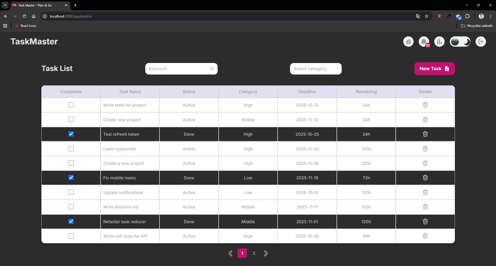

# TaskMaster Frontend

_Main Dashboard_

_Dark Theme_

_Statistics Page_

_Login Page_

_Adding Data Modal Window_


Frontend application for **TaskMaster** — a task management platform with deadlines, notifications, and user authentication. Built with React, Redux Toolkit, SCSS, and Webpack.

## Features

- User registration, login, and password update
- JWT-based authentication with access and refresh tokens
- Task management: create, update, complete, and delete tasks
- Task notifications: reminders, deadlines, and overdue alerts
- Dark/light theme toggle
- Responsive design for mobile and desktop
- Automatic token refresh and optimistic UI updates
- Error handling with modals and loaders
- Validation of forms, deadlines, and data
- Custom favicon and app branding

## Technologies

- React 18 / Hooks
- Redux Toolkit for state management
- React Router for navigation
- Axios with interceptors for API calls
- SCSS for styling
- Webpack for bundling
- Yup for validating all forms

## Installation

```bash
git clone https://github.com/Rohozhnyi-Illia/Task-Master.git
cd Task-Master
npm install
```

## Running

```bash
npm start # development mode
npm run build # production build
```

Default frontend URL: http://localhost:3000

## Pages

- **Login** — user authentication
- **SignUp** — create a new account
- **UpdatePassword** — change password
- **Application** — main dashboard with tasks and notifications
- **StatsPage** — overview of completed tasks

## API Services

Frontend communicates with TaskMaster-Backend through Axios services:

## AuthService

- register({ email, password, name }) — register a new user
- login({ email, password }) — login
- logout() — logout
- updatePassword({ email, newPassword, repeatPassword }) — change password

## TaskService

- getAllTasks() — get all tasks
- createTask({ task, status, category, deadline, remainingTime }) — create a new task
- deleteTasks(id) — delete a task
- completeTask(id) — mark a task as completed
- updateStatus(id, status) — update task status

## NotificationService

- getUserNotifications() — get user notifications
- markAsRead(id) — mark a notification as read
- deleteNotification(id) — delete a notification

## Notes

- First version of the project; no email integration yet
- Backend must be running for frontend to function correctly

## Author

Illia Rohozhnyi
